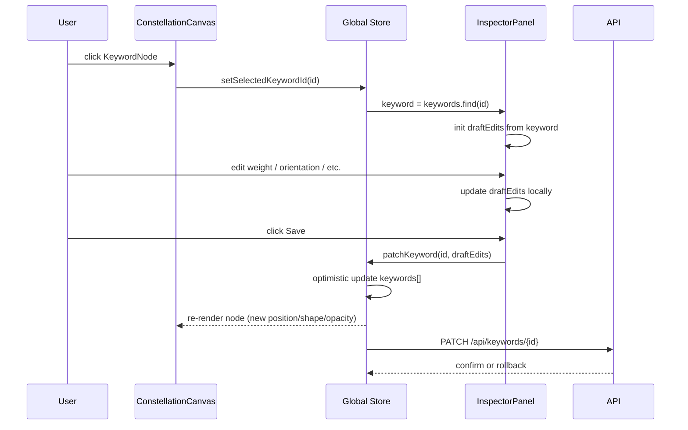
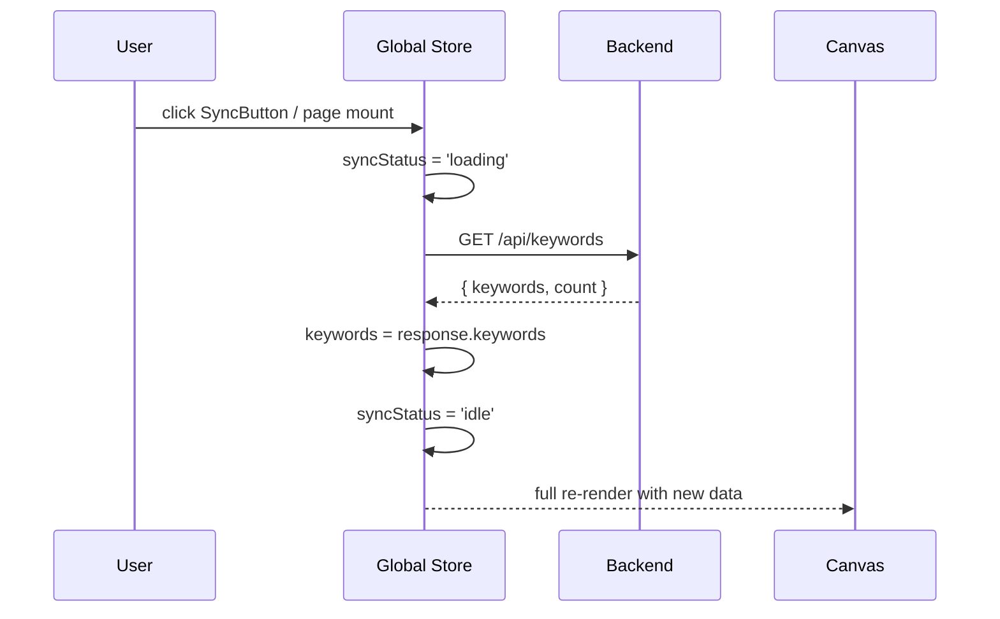

# React UI Architecture — FramingConstellationBot

---

## Pages (Routes)

| Route | Purpose |
|---|---|
| `/constellation` | **Keyword constellation map** — React Flow canvas showing keywords as nodes positioned around four orientation centers. Users inspect, edit, toggle, and re-weight keywords here. |
| `/framing` | **Framing workspace** — input `user_context`, trigger the pipeline, preview the 8-field framing result (RQ, background, purpose, method, result, contribution, abstract_en, abstract_zh), then save to Notion DB1. |

---

## Component Tree

### `/constellation`

```
<App>
  <NavBar />                          ← route links + sync status
  <ConstellationPage>
    <Toolbar>
      <SyncButton />                  ← GET /api/keywords → refresh
      <FilterBar />                   ← filter by orientation / artifact_role / active
    </Toolbar>
    <ConstellationCanvas>             ← React Flow wrapper
      <KeywordNode />                 ← custom node (×N)
      <OrientationCenter />           ← 4 fixed anchor nodes (exploratory / critical / problem_solving / constructive)
      <MiniMap />
      <Controls />
    </ConstellationCanvas>
    <InspectorPanel>                  ← slide-in right panel, shown when a node is selected
      <KeywordForm>
        <TermDisplay />
        <OrientationSelect />
        <ArtifactRoleSelect />
        <PipelineRoleSelect />
        <WeightSlider />
        <ActiveToggle />
        <NotesTextarea />
        <SourceBadge />
      </KeywordForm>
      <SaveButton />                  ← PATCH /api/keywords/{id}
      <DeleteButton />                ← (optional) archive keyword
    </InspectorPanel>
  </ConstellationPage>
</App>
```

### `/framing`

```
<App>
  <NavBar />
  <FramingPage>
    <ContextInput>                    ← textarea for user_context
      <OwnerField />                  ← optional owner string
      <RunButton />                   ← POST /api/framing/run
    </ContextInput>
    <FramingResult>                   ← only visible after pipeline returns
      <ProfileSummary>                ← bar charts for epistemic_profile + artifact_profile
        <EpistemicChart />
        <ArtifactChart />
      </ProfileSummary>
      <FramingFields>                 ← 6 editable text blocks
        <FieldCard field="research_question" />
        <FieldCard field="background" />
        <FieldCard field="purpose" />
        <FieldCard field="method" />
        <FieldCard field="result" />
        <FieldCard field="contribution" />
      </FramingFields>
      <AbstractPreview>               ← side-by-side EN / ZH
        <AbstractCard lang="en" />
        <AbstractCard lang="zh" />
      </AbstractPreview>
      <SaveButton />                  ← POST /api/framing/save
    </FramingResult>
  </FramingPage>
</App>
```

---

## State Model

### Global (shared via Context or Zustand)

| State | Type | Source |
|---|---|---|
| `keywords` | `NotionKeyword[]` | `GET /api/keywords` on mount |
| `selectedKeywordId` | `string \| null` | set by clicking a node |
| `syncStatus` | `'idle' \| 'loading' \| 'error'` | tracks Notion sync |
| `framingResult` | `PipelineResult \| null` | returned by `POST /api/framing/run` |

### Local (component-scoped)

| Component | Local State |
|---|---|
| `InspectorPanel` | `draftEdits: Partial<Keyword>` — buffered edits before PATCH |
| `ContextInput` | `userContext: string`, `owner: string` |
| `FilterBar` | `activeFilters: { orientation?, artifact_role?, activeOnly? }` |
| `FramingFields` | `editedFields: Partial<FramingResult>` — local overrides before save |

### Selected Keyword Flow



### Syncing from Notion



> [!NOTE]
> On mount, `keywords` is fetched once. `SyncButton` re-fetches on demand. No WebSocket / polling — Notion is the source of truth, manually refreshed.

### Edits Persistence

1. User edits a field in `InspectorPanel` → stored in `draftEdits` (local)
2. User clicks **Save** → `PATCH /api/keywords/{id}` with changed fields
3. **Optimistic update**: `keywords[]` in global store is patched immediately
4. If PATCH fails → rollback the optimistic change, show error toast
5. Canvas re-renders the node (position, shape, opacity may all change)

---

## Interaction Mapping

| User Action | Handler | API Call | UI Effect |
|---|---|---|---|
| Click node | `onNodeClick` → `setSelectedKeywordId` | — | Open InspectorPanel with keyword data |
| Click canvas bg | `onPaneClick` → `setSelectedKeywordId(null)` | — | Close InspectorPanel |
| Edit in inspector → Save | `handleSave()` | `PATCH /api/keywords/{id}` | Optimistic update node + close inspector |
| Toggle active | `handleToggle()` | `PATCH /api/keywords/{id}` `{active}` | Node opacity changes (1.0 → 0.3) |
| Change orientation | `handleSave()` | `PATCH /api/keywords/{id}` `{orientation}` | Node moves to new orientation center |
| Change artifact_role | `handleSave()` | `PATCH /api/keywords/{id}` `{artifact_role}` | Node shape changes |
| Change weight | `handleSave()` | `PATCH /api/keywords/{id}` `{weight}` | Node distance from center changes |
| Click Sync | `handleSync()` | `GET /api/keywords` | Full keyword refresh + re-layout |
| Run framing | `handleRun()` | `POST /api/framing/run` | Show FramingResult panel with 8 fields + profiles |
| Save framing | `handleSaveFraming()` | `POST /api/framing/save` | Toast "Saved to Notion" + Notion page ID |

---

## UI / Visual Spec

### React Flow — Constellation Canvas

#### Four Fixed Orientation Centers

```
                    exploratory
                   (0, -400)
                       ●

    critical                       constructive
   (-500, 0)  ●                ●  (500, 0)

                       ●
                 problem_solving
                    (0, 400)
```

- Centers are **non-draggable anchor nodes** with distinct colors
- Each center has a subtle radial gradient background aura

#### Keyword Node Positioning

| Property | Visual Mapping |
|---|---|
| **Orientation** | Which center the node orbits around |
| **Weight** | Distance from center: `distance = MAX_RADIUS × (1 - weight)` — weight 1.0 = closest, weight 0.3 = farthest |
| **Artifact Role** | Node shape (see below) |
| **Active** | Opacity: `active ? 1.0 : 0.3` |

> [!TIP]
> Nodes with equal weight are spread evenly around the center using angular offset: `angle = (index / countInGroup) × 2π`

#### Node Shapes by Artifact Role

| Artifact Role | Shape | CSS/SVG | Color Accent |
|---|---|---|---|
| `probe` | Circle | `border-radius: 50%` | Teal |
| `critique_device` | Diamond | `rotate(45deg)` square | Crimson |
| `generative_construct` | Hexagon | CSS clip-path | Amber |
| `solution_system` | Rounded rect | `border-radius: 8px` | Indigo |
| `epistemic_mediator` | Octagon | CSS clip-path | Violet |

#### Layout Recalculation

When a PATCH changes `orientation`, `weight`, or `artifact_role`:

```typescript
function computeNodePosition(keyword: Keyword, index: number, groupSize: number): { x: number; y: number } {
    const center = ORIENTATION_CENTERS[keyword.orientation];
    const distance = MAX_RADIUS * (1 - keyword.weight);
    const angle = (index / groupSize) * 2 * Math.PI;
    return {
        x: center.x + distance * Math.cos(angle),
        y: center.y + distance * Math.sin(angle),
    };
}
```

After PATCH success → recompute all positions → `setNodes(newPositions)` → React Flow animates via `nodesDraggable` transition.

---

## Recommended Libraries

| Concern | Library | Reason |
|---|---|---|
| Flow canvas | `reactflow` (already installed) | Custom nodes, minimap, controls |
| State mgmt | `zustand` | Lightweight, no boilerplate, good for shared keyword state |
| Routing | `react-router-dom` | `/constellation` and `/framing` |
| HTTP | `fetch` (native) | No extra dep needed, backend is same-origin via Vite proxy |
| Charts | `recharts` | Epistemic/artifact profile bar charts on Framing page |
| Toast | `react-hot-toast` | Lightweight success/error feedback |
